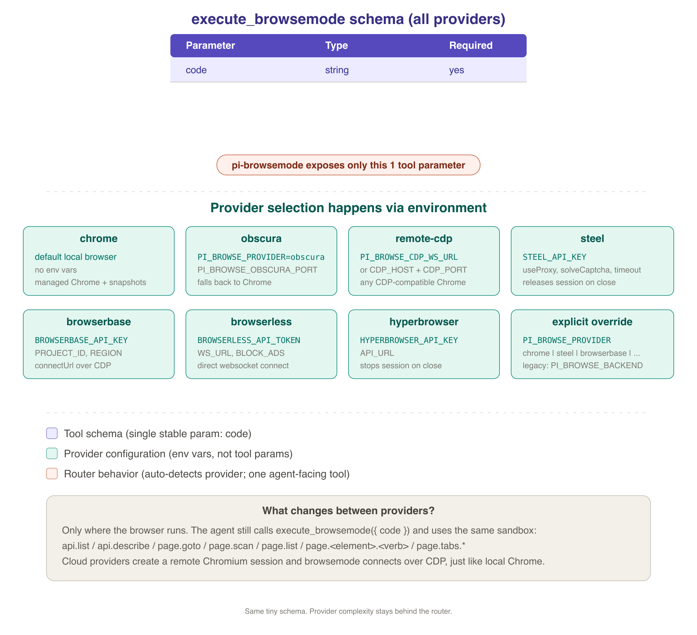

# 🦾 browsemode

**Code mode for the web.** Drive a real browser by writing typed JavaScript that addresses elements by name, not by selector or pixel coordinate.

```ts
await browser.exec(`
  await page.goto("https://news.ycombinator.com");
  await page.searchInput.fill("rust");
  await page.searchSubmit.click();
  return await page.list();
`);
```

That code runs against a live Chrome — local, remote over CDP, or hosted by Steel, Browserbase, Browserless, or Hyperbrowser. The agent writes code against named elements instead of selectors or pixels, and uses explicit browser-aware waits when the page is dynamic.

## Why

Most browser tools for agents fall into one of two camps:

- **Selector-based frameworks** (Playwright, Selenium, Puppeteer) require fragile CSS or XPath. One DOM rename and the script breaks.
- **High-level agents** (browser-use, Stagehand `agent`) are autonomous loops that decide every click. They are unpredictable in production and burn tokens on each step.

browsemode sits between the two. The page is scanned into a **typed catalog of named elements**, fed to the model as part of its scratchpad, and the model writes one short script. The script runs in a QuickJS sandbox with the same `page` API a TypeScript caller would use. One reasoning step, many actions, deterministic dispatch.

## Quickstart

```bash
bun add browsemode
```

```ts
import { Browsemode } from "browsemode";

const browser = await Browsemode.launch({ id: "research" });
await browser.newPage({ url: "https://example.com" });
await browser.scan();

await browser.click("signInButton");
await browser.fill("emailInput", "user@example.com");

const result = await browser.exec(`
  await page.signInButton.click();
  await page.waitFor({ stable: { forMs: 1000 } });
  return await page.title();
`);

await browser.detach();
```

`browser.exec(code)` is the agent path. The string body runs inside a QuickJS sandbox. Every `page.*` call funnels back through the same `dispatch(path, args)` entry point that the TS sugar methods use, so behavior is identical.

## CLI

`browsemode` is not just a wrapper around Playwright. The CLI is the browser engine exposed as commands: it opens or restores a named browser, scans the page into a catalog of callable elements, then runs sandboxed JavaScript against that catalog. An agent that can shell out gets the same named-element engine as the SDK.

```bash
# Start or reattach a persistent browser session.
browsemode browser open --id research --url https://github.com

# See the action surface: named elements, kinds, labels, supported verbs.
browsemode scan --browser research

# Run one deterministic script against the live browser.
browsemode exec --browser research '
  const hits = await page.find("issues");
  return { title: await page.title(), hits };
'

# Read content without a browser when you only need markdown.
browsemode read https://example.com
```

The core loop is `open → scan → exec`. `scan` turns the current page into names like `searchInput`, `submitButton`, and `issuesLink`; `exec` lets code call those names directly as `await page.searchInput.fill("...")` or `await page.issuesLink.click()`. The browser id is the durable handle — tabs, cookies, scroll position, and the last snapshot survive across CLI invocations.

For automation, every command supports `--json` for stable machine output and `--quiet` for pipelines:

```bash
browsemode scan --browser research --json
browsemode exec --browser research --json 'return await page.list()'
browsemode cookies dump --domain github.com | browsemode cookies inject
```

`browsemode doctor` diagnoses Chrome/CDP/config issues, and errors point at the next command to run.

## Features

**Named elements, not selectors.** A scan produces `{ name: "signInButton", kind: "button", text: "Sign in", ... }` for every interactable on the page. The names survive most DOM rewrites because they're derived from labels, ARIA, placeholder text, and surrounding context.

**Multi-browser by id.** Every `Browser` has an id. State (target ids, active tab, cookies) lives at `<cacheDir>/browsers/<id>.json`. `Browsemode.restore("research")` reattaches across processes:

```ts
const a = await Browsemode.connect({ id: "research" });
await a.detach();                                // keep the live browser, save state
const b = await Browsemode.restore("research");  // later, in another process
```

**Local or cloud browsers, one API.** Chrome is the production path: full CDP, real layout, dialogs, downloads, screenshots, cookies, and watchdogs. You can run it locally, connect to any remote CDP websocket, or — through the pi extension — route the same browser surface to hosted providers like Steel, Browserbase, Browserless, and Hyperbrowser. Same `Browser` class either way, calling code never branches.

|  | Local Chrome / CDP | Hosted providers |
|---|---|---|
| Where it runs | local machine or your infra | Steel / Browserbase / Browserless / Hyperbrowser |
| Connection | CDP host/port or websocket | CDP websocket returned by provider |
| Navigate, scan, fill, type, eval, markdown | yes | yes |
| Tabs | yes | yes |
| Layout-aware click, dialogs, downloads | yes | provider Chromium path |
| Lifecycle | snapshots + detach/restore | provider session close/release/stop |

Hosted providers matter when you want remote execution, stealth/proxies, live viewers, recordings, or managed browser fleets. Obscura support still exists as an experimental lightweight local runtime, but the README and default path are Chrome-first.

**Vision via markdown, not screenshots.** Pages render through [markit](https://github.com/Michaelliv/markit) when the agent needs to read content. Deterministic, cheap, no image tokens.

**Iframe-aware scans.** Cross-origin iframes are auto-attached; their elements appear in the same flat catalog with the same names.

**Real Chrome cookie sync.** Read your local Chrome's cookies (SQLite + macOS Keychain) and inject them into a browsemode-managed browser to skip scripted login.

## Configuration

Every knob is a `BROWSEMODE_*` env var or a `Browsemode.configure({...})` call. The 15 most-used:

| Variable | Meaning |
|---|---|
| `BROWSEMODE_CACHE_DIR` | where snapshots live |
| `BROWSEMODE_DEFAULT_BROWSER_ID` | id used when none is passed |
| `BROWSEMODE_CHROME_PATH` | explicit Chrome binary (overrides auto-detection) |
| `BROWSEMODE_CHROME_PORT` | port for the managed Chrome |
| `BROWSEMODE_CHROME_ARGS` | extra Chrome flags (comma-separated) |
| `BROWSEMODE_SETTLE_MS` | how long to wait after a navigation |
| `BROWSEMODE_CDP_TIMEOUT_MS` | max time for any CDP call |
| `BROWSEMODE_PROBE_TIMEOUT_MS` | max time to verify a browser is alive |
| `BROWSEMODE_NAV_TIMEOUT_MS` | navigation timeout |
| `BROWSEMODE_NO_SHIM` | disable the obscura DOM shim |
| `BROWSEMODE_NO_STEALTH` | disable headless-detection patches |
| `BROWSEMODE_DEBUG` | verbose bus events to stderr |

Run `browsemode config show` for the full list and resolved values.

For Docker:

```dockerfile
ENV BROWSEMODE_CACHE_DIR=/data/browsemode
ENV BROWSEMODE_CHROME_PATH=/usr/bin/chromium
ENV BROWSEMODE_CHROME_ARGS=--no-sandbox,--disable-dev-shm-usage
ENV BROWSEMODE_DEFAULT_BROWSER_ID=container-1
```

## How it compares

| | browsemode | browser-use | Stagehand | Playwright MCP |
|---|---|---|---|---|
| Element addressing | named (`page.signInButton`) | numeric index (`click 0`) | natural language (`act("click sign in")`) | accessibility refs (`ref=e3`) |
| Reasoning per task | one script | many tool calls | many primitives | many tool calls |
| Driver | direct CDP | direct CDP | Playwright | Playwright |
| Default browser | Chrome-first; cloud via pi provider router; Obscura experimental | Chromium (200+ MB RAM) | Chromium / cloud | Chromium (200+ MB RAM) |
| Docker image cost | local Chrome unless using remote CDP/cloud | full Chromium install | full Chromium install or Browserbase | full Chromium install |
| Cold start | local Chrome ~2s; remote depends on provider | ~2 s | ~2 s / provider-dependent | ~2 s |
| Fallback browser | Chrome, Brave, Edge, Arc (transparent) | Chromium | Chromium / cloud | Chromium / Firefox / WebKit |
| Layout-aware click | Chrome only (obscura: JS click) | yes | yes | yes |
| JS dialogs (alert/confirm/prompt) | Chrome only (obscura no-ops them) | yes | yes | yes |
| Browser-level downloads | Chrome only | yes | yes | yes |
| Request interception (Fetch.*) | Chrome only (obscura PR [#50](https://github.com/h4ckf0r0day/obscura/pull/50) pending) | not exposed | yes | yes |
| Vision | markdown via markit | screenshots | optional | accessibility snapshots |
| Sandbox | QuickJS | none | none | none |
| Persistence | id-keyed snapshots | session dir | profile dir | profile dir |

This is not a "better than" claim. The right tool depends on the workload. browsemode is built for agents that already speak code well and want a low-token, deterministic surface where one block of JS replaces a chain of tool calls.

## Repo layout

This is a Bun workspace monorepo:

```
packages/browsemode/    SDK + CLI (this is what most users want)
packages/pi-browsemode/ pi extension: one tool, provider router, in-sandbox discovery
```

`pi-browsemode` is a [pi](https://pi.dev) extension. It registers a single tool, `execute_browsemode`, that runs JavaScript in browsemode's sandbox against a real browser. The browser persists across tool calls; element discovery (`api.list()`, `api.describe(path)`, `page.list()`, `page.find(query)`, `page.describe(name)`) lives inside the sandbox, so the agent's system prompt stays small. Lives at `packages/pi-browsemode/.pi/extensions/browsemode/index.ts`.

The pi package follows the same router pattern as `pi-websearch`: one stable agent-facing schema, provider complexity behind environment variables. By default it launches managed Chrome. Set `STEEL_API_KEY`, `BROWSERBASE_API_KEY`, `BROWSERLESS_API_TOKEN`, `HYPERBROWSER_API_KEY`, or `PI_BROWSE_CDP_WS_URL` to route the same tool to a hosted/remote browser. Force a provider with `PI_BROWSE_PROVIDER=chrome|remote-cdp|steel|browserbase|browserless|hyperbrowser`. `obscura` remains available as an experimental provider for local lightweight testing.



## Development

```bash
bun install
bun test                # 250+ tests across packages
bun run typecheck       # tsc --noEmit
bun run lint            # biome check
bun run packages/browsemode/src/cli/main.ts --help
```

CI runs tests, typecheck, and lint on every push.

For agents working in this repo, see [AGENTS.md](AGENTS.md) for architecture, conventions, and how to add new verbs and CLI commands.


## License

MIT. See [LICENSE](LICENSE).
